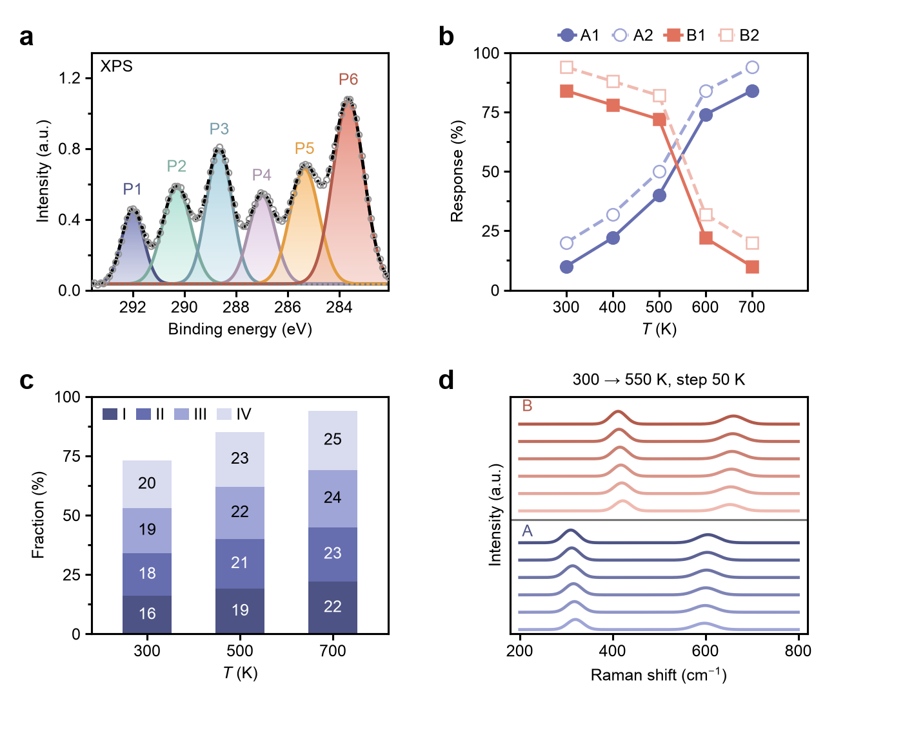

# nature-figure skill

Editable scientific figures in Python or R. The active personal chemistry template is
specified in [SKILL.md](SKILL.md), [layout-contract](references/layout-contract.md) and
[colour contract](references/color-contract.md). User instructions override defaults.

Three-panel final-width reference: 160 mm; plots 39 × 31.2 mm; Arial axes and ordinary
text 6 pt, panel labels 10 pt bold with baseline 1 mm above the frame. Pure-black full frames 0.75 pt, curves 1.125 pt.
Point-line markers 4.5 pt, row/column frame gaps 14/16 mm, outer-edge bar margins. Colourbar
right borders follow the ordinary unshortened column frame, not narrowed twins.
Registered two-family schemes: blue-violet/coral (default), blue-violet/yellow, and blue-violet/orange. Primary 3 yellow and Primary 4 orange are mutually exclusive. Curves use main, paired curves main/mid; ordinary non-stacked bars use a main-to-mid gradient with mean and sample SD for replicates, while other non-peak closed shapes use light/outline. Scheme-specific extensions require explicit instruction; cyan/blue/violet retain one anchor each. Axis units use parentheses; data-matched major x ticks omit minor ticks.

Approved palette test: `python scripts/preview_six_colors.py OUTPUT_DIRECTORY`.
Six-colour XPS, two paired objects, four-layer stacks without errors, and two-family Raman:

Electrochemistry nine-panel test: `python scripts/preview_electrochemistry.py OUTPUT_DIRECTORY`.

Python helpers: `scripts/publication_colors.py`, `scripts/publication_style.py`.
Earlier chemistry stress test: `python scripts/preview_template.py OUTPUT_DIRECTORY`.
Compatibility entry point for the current six-colour palette test: `python scripts/preview_palette.py OUTPUT_DIRECTORY`.
See [API](references/api.md), [tutorial](references/tutorials.md), [QA](references/qa-contract.md)
and [R workflow](references/r-workflow.md). Backend selection persists within a conversation;
no cross-language drawing fallback. Final scripts embed needed helpers and expose parameters.

Historical galleries and figures4papers assets are retained as layout/data-pattern examples,
not active colour/font/size defaults. Origin: [figures4papers](https://github.com/ChenLiu-1996/figures4papers).

## Example output gallery

The images below are historical simulated mockups; their old typography/colours are not active defaults:
editable SVG-first export, restrained semantic palettes, lowercase panel labels, and
asymmetric multi-panel information architecture. They are PNG previews for README display;
production use should still export SVG/PDF from the plotting script.

| Figure | Preview | What the skill demonstrates |
|--------|---------|-----------------------------|
| Material design and physical validation |  | Schematic-led composite, SEM-like image panel, rheology, release kinetics, retention map, correlation and endpoint quantification |
| Spatial retention and uptake |  | Dark microscopy plate, channel rows, zoom crops, depth profiles, uptake histograms, 3D penetration heatmap and image-derived correlation |
| In vivo efficacy and tolerability |  | Experimental timeline, longitudinal tumour curves, individual growth traces, waterfall response, forest plot, histology, immune composition and toxicity panels |
| Single-cell systems figure |  | UMAP-style embedding, composition, marker heatmap, pseudotime, volcano plot, enrichment, ligand-receptor bubble matrix and spatial niche adjacency |
| Perturbation validation |  | Mechanistic perturbation timeline, relapse endpoint, polar summary, dose response, synergy matrix, biodistribution, cytokines, flow-like scatter and safety score |

**Gallery file policy**  
Keep only lightweight PNG previews in `assets/gallery/`. Do not commit large generated
SVG/PDF outputs unless they are needed for a tutorial, because real users should regenerate
editable outputs from source data and scripts.

---

## Chart-type atlas

The gallery below classifies the skill by chart family. Each preview is a dense 4 x 4
atlas of small panels, designed to show the range of visual grammars that can be combined
inside a larger *Nature*-style result figure.

| Type | Preview | Common use |
|------|---------|------------|
| Bar charts |  | Group comparisons, signed deltas, grouped-within-grouped designs, stacked composition |
| Line and longitudinal trends |  | Time courses, uncertainty ribbons, intervention marks, individual traces |
| Heatmaps |  | Z-score matrices, sequential abundance maps, annotated tables, clustered blocks |
| Scatter and bubble plots |  | Correlation, clusters, volcano-style tests, quadrant summaries, third-variable bubbles |
| Radar and polar charts |  | Multi-axis benchmarking, circular summaries, polar histograms, directional density |
| Distribution plots |  | Histograms, violins, boxes, ridgelines and sample-level spread |
| Forest and interval plots |  | Effect sizes, confidence intervals, point ranges, paired slope comparisons |
| Area and stacked trends |  | Filled trajectories, stacked shares, cumulative curves, stream-like compositions |
| Image plates |  | Microscopy channels, overlays, crops, scale bars and dark-panel layouts |
| Network and matrix charts |  | Bubble matrices, adjacency maps, node-link diagrams and bipartite interaction panels |

---
